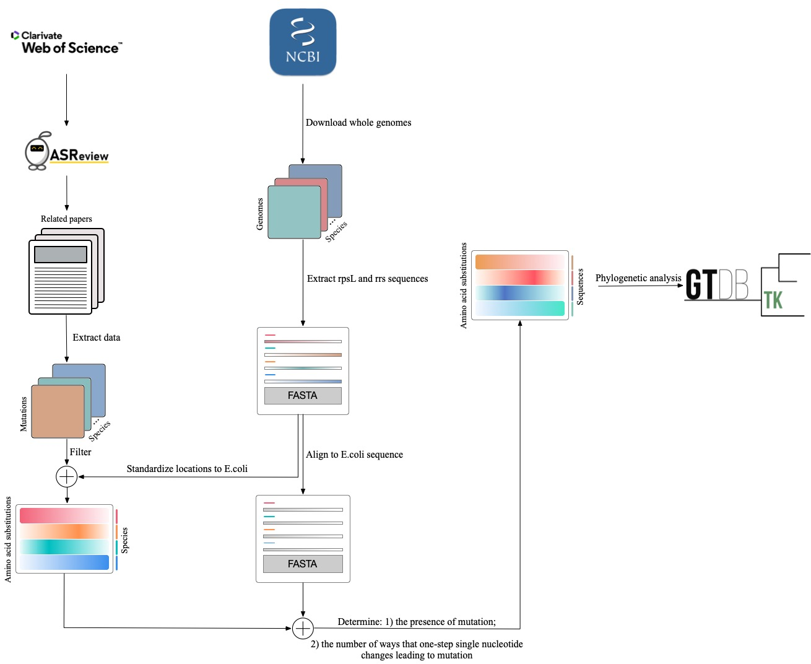

# Streptomycin Resistance Landscape
This repository contains the data, code, and analysis for a project investigating streptomycin (STR) resistance across the bacterial tree of life, focusing on resistance mutations in the rpsL and rrs genes.

## Overview
This project aims to assess both intrinsic resistance—where streptomycin resistance mutations are already present in bacterial genomes—and the evolutionary potential for bacteria to acquire resistance through single-nucleotide mutations. Using a computational framework adapted from previous work on rifampicin [1], the analysis screens a curated panel of resistance-associated mutations in the rpsL and rrs genes to map resistance patterns across the bacterial tree of life and quantify species-specific evolvability. The workflow for this project is illustrated in figure below.

## Contents

- R/: Contains all analysis scripts, including:

  - master.R: Pipeline for analyzing rpsL mutations. This script runs the complete streptomycin resistance analysis, including genome retrieval, mutation screening, phylogenetic mapping, codon network modeling, structural analysis, and report generation.
  - master_nt.R: Pipeline for analyzing rrs mutations. This script is intended to parallel the rpsL workflow but is currently incomplete and includes only partial steps of the analysis.
      
- data/: Input data files and metadata required for analysis.

- output/: Intermediate analysis outputs, such as filtered sequences and mutation screens.

- plots/: Final figures generated for the project.

- results/: Summary tables and final processed results.

## Citation

[1] Bolourchi, N., Brown, C. R. P., Letten, A. D., & Engelstädter, J. (2024). Evolution and evolvability of rifampicin resistance across the bacterial tree of life. bioRxiv. 

## Author
Le Na Ngo <https://github.com/lna0104>

