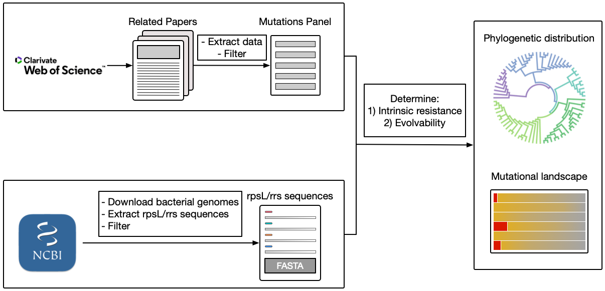

# Streptomycin Resistance Evolvability

## Project Overview

This repository implements a computational pipeline to map streptomycin (STR) resistance across bacterial genomes. Building on a framework developed for rifampicin [1](https://doi.org/10.1073/pnas.2424307122), the analysis screens \~20,000 bacterial genomes for known resistance mutations in the *rpsL* and *rrs* genes (ribosomal protein S12 and 16S rRNA, respectively). The goals are to identify taxa with intrinsic resistance (mutations already present) and those with high evolvability (potential to acquire resistance via single-nucleotide changes). The workflow for this project is illustrated in Figure 1.



**Figure 1.** Overview of the computational workflow used in this project to analyze streptomycin resistance across the bacterial tree of life.

Two complementary pipelines assess resistance patterns for each gene:

| Gene | Encodes | Mutation type | Analysis level | Script |
|----|----|----|----|----|
| **rpsL** | Ribosomal protein S12 | Amino acid substitutions | Protein-level | `R/master.R` |
| **rrs** | 16S ribosomal RNA | Nucleotide substitutions | Nucleotide-level | `R/master_nt.R` |

Both workflows use standardized mutation curation, genome screening, and phylogenetic mapping to produce a global view of STR resistance potential.

## Repository Structure

```{bash}
Streptomycin_Resistance_Landscape/
├── R/                        # Core R scripts for all analyses
│   ├── master.R              # Main pipeline for rpsL analysis (amino acid level)
│   ├── master_nt.R           # Main pipeline for rrs analysis (nucleotide level)
│   ├── rickettsia_master.R   # Main pipeline for rickettsia analysis (amino acid level)
│   ├── util.R                # Utility functions (e.g., extract species names)
│   ├── process_nt_data.R     # Functions adapted from ALJEbinf for nucleotide data
│   ├── analyses*.R           # Functions for mutation screening, alignment comparison, evolvability assessment, and resistance summarization
│   ├── bioinformatics*.R     # Functions for downloading, parsing, and organizing NCBI RefSeq genomes and taxonomy data
│   ├── phylogenetics*.R      # Tree construction and plotting
│   ├── codon_networks.R      # Codon mutational network analysis
│   ├── structure.R           # Structural and conservation analysis
│   ├── plotting*.R           # Plot generation functions
│   ├── reports*.R            # Report rendering and summary functions
│   ├── google_sheet_to_csv.R # Convert literature review Google Sheet to CSV format
│
├── data/                  # Input data and metadata
│   ├── reported_mutations.csv     # Curated list of resistance-associated mutations
│   ├── *_references.fasta         # Reference sequences
│   ├── bac120.nwk                 # GTDB bacterial phylogenetic tree
│   ├── gtdb_taxonomy              # Processed GTDB taxonomy table
│   ├── *_NCBI_taxonomy            # NCBI taxonomy for retrieved genomes
│   └── summary_preamble.qmd       # Report preamble
│
├── results/               # Summaries and final reports (.txt, .csv, .qmd)
├── plots/                 # Figures and visualizations (.pdf, .svg, .html)
└── README.md              # Project overview and reproducibility guide

```

## Prerequisites

-   R version: 4.4.3

-   Recommended environment: Unix/MacOS or Linux server (due to parallelization and large downloads).

-   Required R packages: tidyverse, Biostrings, pwalign, rentrez, ape, ggtree, phytools, bio3d, castor, ggh4x, pander, quarto, cowplot, igraph, tidygraph, and others (see master.R for full list).

## Citation

[1]: <https://doi.org/10.1073/pnas.2424307122> Bolourchi, N., Brown, C. R. P., Letten, A. D., & Engelstaedter, J. (2024, November). Evolution and evolvability of rifampicin resistance across the bacterial tree of life.

## Author & Contact

Lê Na Ngô – Author and maintainer (lna0104). For questions or issues, please open an issue on the GitHub repository: github.com/lna0104/Streptomycin.
